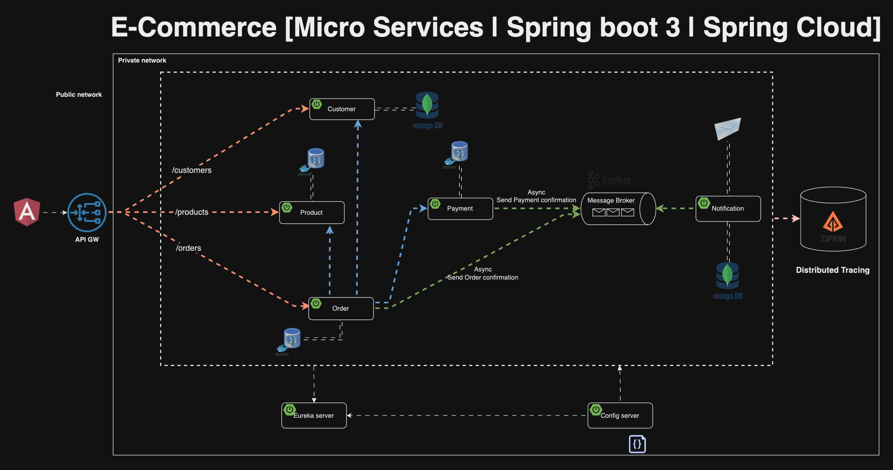
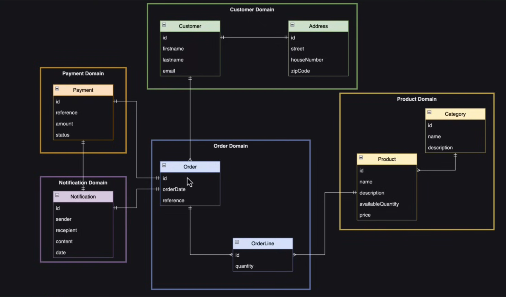

# E-commerce Microservices (Spring Boot)

Dự án mô phỏng hệ thống e-commerce theo kiến trúc microservices, tập trung vào việc áp dụng các nguyên tắc **system design** trong thực tế: phân tách domain, giao tiếp đồng bộ/bất đồng bộ, cấu hình tập trung, service discovery và API gateway.

Mục tiêu chính của repository này là đóng vai trò như một tài liệu tham khảo kỹ thuật cho việc thiết kế và triển khai hệ thống phân tán bằng Spring Boot/Spring Cloud.

## 1) Giới thiệu

Hệ thống được tách theo từng domain nghiệp vụ độc lập:

- Quản lý khách hàng
- Quản lý sản phẩm và tồn kho
- Quản lý đơn hàng
- Thanh toán
- Gửi thông báo

Các service giao tiếp theo 2 hướng:

- **REST (đồng bộ)**: cho các thao tác cần phản hồi ngay.
- **Kafka (bất đồng bộ)**: cho event nghiệp vụ, giảm coupling giữa các service.

## 2) Mục tiêu dự án

- Xây dựng một kiến trúc microservice rõ ràng, dễ mở rộng.
- Minh hoạ cách tổ chức hệ thống theo domain-driven boundaries.
- Áp dụng pattern phổ biến trong hệ phân tán:
	- Centralized Configuration (`config-server`)
	- Service Discovery (`discovery` - Eureka)
	- API Gateway (`gateway`)
	- Event-Driven Communication (Kafka)
- Làm nền tảng học tập/phỏng vấn/thực hành system design cho bài toán e-commerce.

## 3) Tổng quan hệ thống

Các thành phần chính:

- `config-server`: Quản lý cấu hình tập trung cho toàn bộ services.
- `discovery`: Eureka Server để đăng ký và tìm kiếm service.
- `gateway`: Điểm vào duy nhất từ client, định tuyến request vào service nội bộ.
- `customer`: Quản lý thông tin khách hàng (MongoDB).
- `product`: Quản lý catalog sản phẩm, tồn kho (PostgreSQL + Flyway).
- `order`: Xử lý tạo đơn, điều phối luồng nghiệp vụ đặt hàng.
- `payment`: Xử lý nghiệp vụ thanh toán.
- `notification`: Nhận event từ Kafka, gửi email và lưu lịch sử thông báo.

## 4) Thiết kế kiến trúc (System Design)

### 4.1 Kiến trúc microservices theo domain

Mỗi service sở hữu một phạm vi nghiệp vụ riêng, giảm phụ thuộc trực tiếp và hỗ trợ scale độc lập theo tải của từng domain.

### 4.2 API Gateway Pattern

`gateway` đóng vai trò entry point cho client:

- Ẩn topology nội bộ của hệ thống.
- Tập trung routing.
- Thuận tiện để mở rộng thêm auth/rate limit/logging ở một điểm chung.

### 4.3 Service Discovery Pattern

`discovery` (Eureka) giúp các service tự đăng ký và tìm thấy nhau động, tránh hardcode địa chỉ service.

### 4.4 Centralized Configuration Pattern

`config-server` cung cấp cấu hình tập trung cho các service, hỗ trợ thay đổi cấu hình nhất quán theo môi trường.

### 4.5 Event-Driven Architecture

Kafka được dùng cho luồng bất đồng bộ:

- `order` và `payment` phát sinh event nghiệp vụ.
- `notification` consume event để gửi email/lưu lịch sử.

Lợi ích:

- Giảm coupling giữa producer/consumer.
- Tăng khả năng mở rộng theo chiều ngang.
- Dễ tích hợp thêm consumer mới trong tương lai.

## 5) Luồng nghiệp vụ chính

Kịch bản tạo đơn hàng (rút gọn):

1. Client gọi API tạo đơn qua `gateway`.
2. `order` kiểm tra dữ liệu khách hàng và sản phẩm.
3. `order` cập nhật tồn kho và tạo đơn.
4. `order` gọi `payment` để xử lý thanh toán.
5. `order`/`payment` phát event lên Kafka.
6. `notification` nhận event, gửi email xác nhận và lưu thông tin thông báo.

## 6) Sơ đồ kiến trúc

### 6.1 System Architecture



### 6.2 Domain Diagram



## 7) Công nghệ sử dụng

- Java 17
- Spring Boot 3
- Spring Cloud (Config Server, Eureka, Gateway, OpenFeign)
- PostgreSQL (order, payment, product)
- MongoDB (customer, notification)
- Apache Kafka + Zookeeper
- Flyway (DB migration cho product service)
- MailDev (test email local)
- Docker Compose

## 8) Hạ tầng local

File `docker-compose.yml` cung cấp các thành phần phục vụ chạy local:

- PostgreSQL + pgAdmin
- MongoDB + mongo-express
- Kafka + Zookeeper
- MailDev

## 9) Cách chạy dự án (tham khảo)

Thứ tự khuyến nghị:

1. Khởi động hạ tầng bằng Docker Compose.
2. Chạy `config-server`.
3. Chạy `discovery`.
4. Chạy lần lượt các business services (`customer`, `product`, `order`, `payment`, `notification`).
5. Chạy `gateway` và bắt đầu gọi API từ phía client.

> Gợi ý: Có thể dùng Maven Wrapper (`./mvnw spring-boot:run`) trong từng service.

## 10) Giá trị học thuật về System Design

Dự án phù hợp để học và thảo luận các chủ đề:

- Bounded Context và ranh giới domain trong microservices.
- Trade-off giữa giao tiếp đồng bộ (REST) và bất đồng bộ (event).
- Tính nhất quán dữ liệu trong hệ phân tán.
- Khả năng chịu lỗi, retry, idempotency (có thể mở rộng thêm).
- Quan sát hệ thống (logging/metrics/tracing) cho production-ready architecture.

## 11) Hạn chế hiện tại và hướng mở rộng

Hạn chế hiện tại:

- Dự án thiên về mục tiêu học kiến trúc, chưa tối ưu cho production.
- Một số cấu hình đang thiên về môi trường local.

Hướng mở rộng đề xuất:

- Bổ sung test coverage (unit/integration/contract).
- Bổ sung bảo mật (OAuth2/JWT, secret management, TLS).
- Thêm resilience patterns (circuit breaker, retry, timeout, DLQ).
- Bổ sung observability (OpenTelemetry, Prometheus, Grafana).
- Chuẩn hoá CI/CD và chiến lược deploy đa môi trường.

## 12) Đối tượng phù hợp

- Người mới bắt đầu với Spring Microservices.
- Backend engineer muốn thực hành system design qua bài toán e-commerce.
- Sinh viên/người tự học cần một dự án end-to-end để phân tích kiến trúc.

## 12) Check list to to feature
Nhóm Latency
- Redis - Tăng tốc độ truy vấn, giảm thiểu việc gọi tới db với những query giống nhau
- Elasticsearch - 

Nhóm Scalability
- Sharding (partitioning) - Chia dữ liệu thành nhiều phần, mỗi DB giữ 1 phần, xử lỷ data lớn, tăng tốc độ query khi phân theo region, ... , chia theo region, id, ...
- Load Balencing

Nhóm Availability- Reliability
- Backup & Restore, postgresql, mongodb - Đảm bảo có thể khôi phục dữ liệu khi bị mất
- [x] Replication postgresql - High Availability (Patroni + etcd + HAProxy + PgBouncer) → xem mục 13
- Replication mongodb - High Availability Đảm bảo việc database luôn available khi có 1 database bị sập, tăng tốc độ đọc bằng cách chia primary - write và slave(replica) - read.

- Bổ sung spring-cloud-starter-loadbalancer trong gateway service

---

## 13) PostgreSQL High Availability Stack (Patroni + etcd + HAProxy + PgBouncer)

### 13.1 Tổng quan topology

```
┌──────────────────────────────────────────────────────────────┐
│                    Spring Boot Services                      │
│         (product-service, order-service, payment-service)    │
└───────────────────────┬──────────────────────────────────────┘
                        │ JDBC
                        ▼
              ┌─────────────────┐
              │   PgBouncer     │  :6432  (Phương án A — khuyến nghị)
              │  pool_mode=     │
              │  transaction    │
              └────────┬────────┘
                       │   hoặc kết nối trực tiếp (Phương án B)
                       ▼
              ┌─────────────────┐
              │    HAProxy      │  :5000 writer / :5001 reader
              │  (health-check  │  :7000 stats UI
              │  Patroni API)   │
              └────────┬────────┘
          ┌────────────┼────────────┐
          ▼            ▼            ▼
    ┌──────────┐ ┌──────────┐ ┌──────────┐
    │ pg-node1 │ │ pg-node2 │ │ pg-node3 │
    │ (primary)│ │(replica) │ │(replica) │
    │  Patroni │ │  Patroni │ │  Patroni │
    └────┬─────┘ └────┬─────┘ └────┬─────┘
         └────────────┼────────────┘
                      ▼
            ┌──────────────────┐
            │   etcd cluster   │  (3 nodes — bầu chọn primary)
            └──────────────────┘
```

**Luồng kết nối:**
- **Patroni** quản lý PostgreSQL, dùng **etcd** để bầu chọn leader (primary) tự động.
- **HAProxy** health-check từng node qua Patroni REST API (`:8008/master` và `:8008/replica`) và chỉ route tới đúng vai trò.
- **PgBouncer** giảm số connection thực tế vào DB bằng transaction pooling.

---

### 13.2 Ports và service names

| Thành phần | Container name | Port (host) | Mô tả |
|------------|---------------|-------------|-------|
| HAProxy writer | `ha_haproxy` | `5000` | PostgreSQL primary (đọc/ghi) |
| HAProxy reader | `ha_haproxy` | `5001` | PostgreSQL replicas (chỉ đọc) |
| HAProxy stats | `ha_haproxy` | `7000` | Dashboard: `http://localhost:7000/stats` |
| PgBouncer | `ha_pgbouncer` | `6432` | Connection pool → primary |
| pg-node1 | `ha_pg_node1` | `5441` | PostgreSQL node 1 (trực tiếp) |
| pg-node2 | `ha_pg_node2` | `5442` | PostgreSQL node 2 (trực tiếp) |
| pg-node3 | `ha_pg_node3` | `5443` | PostgreSQL node 3 (trực tiếp) |
| Patroni API node1 | `ha_pg_node1` | `8008` | `GET /master`, `/replica`, `/health` |
| Patroni API node2 | `ha_pg_node2` | `8009` | Patroni REST API node 2 |
| Patroni API node3 | `ha_pg_node3` | `8010` | Patroni REST API node 3 |

> **Khi Spring Boot chạy local** (JVM process), dùng `localhost:PORT`.  
> **Khi Spring Boot chạy trong Docker** (trên cùng network `microservices-net`), dùng container name: `ha_pgbouncer:6432` hoặc `ha_haproxy:5000`.

---

### 13.3 Khởi động HA Stack

```bash
# Bước 1: Tạo Docker network dùng chung (nếu chưa có)
docker network create microservices-net 2>/dev/null || true

# Bước 2: Khởi động hạ tầng cơ bản (Kafka, MongoDB, MailDev, Keycloak, Zipkin)
docker compose up -d

# Bước 3: Build và khởi động HA stack
docker compose -f docker-compose.ha.yml up -d --build

# Kiểm tra Patroni cluster (chờ ~30 giây để cluster khởi tạo)
docker exec ha_pg_node1 patronictl -c /etc/patroni/patroni.yml list

# Kết quả mong đợi:
# + Cluster: postgres-ha (xxxxxxxx) +---------+----+-----------+
# | Member   | Host         | Role    | State   | TL | Lag in MB |
# +----------+--------------+---------+---------+----+-----------+
# | pg-node1 | ha_pg_node1:5432 | Leader  | running |  1 |           |
# | pg-node2 | ha_pg_node2:5432 | Replica | running |  1 |         0 |
# | pg-node3 | ha_pg_node3:5432 | Replica | running |  1 |         0 |
# +----------+--------------+---------+---------+----+-----------+

# Kiểm tra HAProxy stats
curl http://localhost:7000/stats
```

---

### 13.4 Kết nối Spring Boot vào PostgreSQL HA

#### Câu hỏi: Spring Boot nên connect vào đâu?

Có **2 phương án**:

| | Phương án A | Phương án B |
|--|-------------|-------------|
| **Đường đi** | Spring Boot → **PgBouncer** (:6432) → HAProxy → Primary | Spring Boot → **HAProxy** (:5000) → Primary |
| **Khuyến nghị** | ✅ Cho microservices | Khi không cần pooling |

---

#### Phương án A — Spring Boot → PgBouncer (:6432) **(Khuyến nghị)**

```yaml
# application.yml — Phương án A: qua PgBouncer
spring:
  datasource:
    # prepareThreshold=0: tắt server-side prepared statements
    # (bắt buộc khi PgBouncer dùng transaction mode)
    url: jdbc:postgresql://localhost:6432/product?prepareThreshold=0
    username: ${DB_USERNAME:root}
    password: ${DB_PASSWORD:12345}
    driver-class-name: org.postgresql.Driver
    hikari:
      maximum-pool-size: 10
      minimum-idle: 2
      idle-timeout: 300000
      connection-timeout: 30000
      validation-timeout: 5000
      keepalive-time: 30000        # Gửi keepalive để phát hiện connection chết
      max-lifetime: 1800000        # Đóng connection sau 30 phút (tránh stale)
      initialization-fail-timeout: -1   # Không fail khi start nếu DB chưa ready
      connection-test-query: SELECT 1
  jpa:
    hibernate:
      ddl-auto: validate
    database: postgresql
    database-platform: org.hibernate.dialect.PostgreSQLDialect
    properties:
      hibernate:
        jdbc:
          lob:
            non_contextual_creation: true
```

**Ưu điểm:**
- ✅ **Connection pooling hiệu quả**: PgBouncer gộp nhiều connection từ HikariCP thành ít connection thực vào PostgreSQL. Khi scale nhiều instance microservice, tổng connection DB không tăng tuyến tính.
- ✅ **Transaction mode**: Connection chỉ bị giữ trong thời gian transaction active, không chiếm connection khi idle → throughput cao hơn.
- ✅ **Phù hợp microservices**: Mỗi service có HikariCP pool riêng; PgBouncer là tầng gộp chung cuối cùng.
- ✅ **Reconnect sau failover**: PgBouncer tự reconnect vào backend mới sau Patroni failover; app chỉ thấy một khoảng ngắn connection error.

**Nhược điểm:**
- ⚠️ **Phải tắt server-side prepared statements**: Thêm `prepareThreshold=0` vào JDBC URL. JPA/Hibernate vẫn chạy bình thường (dùng client-side caching thay thế).
- ⚠️ **Không dùng được session-level features**: Temporary tables, advisory locks, `SET search_path` trên session, `LISTEN/NOTIFY` không hoạt động trong transaction mode.
- ⚠️ **Thêm một thành phần**: Phải monitor thêm PgBouncer.

---

#### Phương án B — Spring Boot → HAProxy (:5000)

```yaml
# application.yml — Phương án B: qua HAProxy trực tiếp
spring:
  datasource:
    url: jdbc:postgresql://localhost:5000/product
    username: ${DB_USERNAME:root}
    password: ${DB_PASSWORD:12345}
    driver-class-name: org.postgresql.Driver
    hikari:
      maximum-pool-size: 10
      minimum-idle: 2
      idle-timeout: 300000
      connection-timeout: 30000
      validation-timeout: 5000
      keepalive-time: 30000
      max-lifetime: 1800000
      initialization-fail-timeout: -1
      connection-test-query: SELECT 1
  jpa:
    hibernate:
      ddl-auto: validate
    database: postgresql
    database-platform: org.hibernate.dialect.PostgreSQLDialect
```

**Ưu điểm:**
- ✅ **Đơn giản hơn**: Ít thành phần, không cần quản lý PgBouncer.
- ✅ **Hỗ trợ đầy đủ PostgreSQL features**: Prepared statements, session variables, advisory locks, `LISTEN/NOTIFY` đều dùng được.
- ✅ **HikariCP kiểm soát pool trực tiếp**: Không có lớp trung gian.

**Nhược điểm:**
- ⚠️ **Không có connection pooling ở tầng hạ tầng**: Mỗi HikariCP connection = 1 real connection vào PostgreSQL. Khi scale nhiều service instances, số connection DB tăng nhanh, có thể vượt `max_connections`.
- ⚠️ **Connection drop khi failover**: Khi HAProxy chuyển backend (sau Patroni failover), connection TCP cũ bị đóng. HikariCP phải detect và tạo connection mới. Cần cấu hình `keepalive-time` và `connection-test-query` để phát hiện nhanh.

---

#### So sánh tổng hợp

| Tiêu chí | A — qua PgBouncer | B — qua HAProxy |
|----------|-------------------|-----------------|
| Connection pooling | ✅ Có (transaction mode) | ❌ Không |
| Server-side prepared statements | ⚠️ Phải tắt (`prepareThreshold=0`) | ✅ Hỗ trợ đầy đủ |
| Session-level features | ⚠️ Không dùng được | ✅ Đầy đủ |
| Failover behavior | ✅ PgBouncer reconnect tự động | ⚠️ HikariCP cần detect & retry |
| Phù hợp scale nhiều instances | ✅ Tốt | ⚠️ Cần cẩn thận với `max_connections` |
| Độ phức tạp hạ tầng | Cao hơn | Thấp hơn |
| Phù hợp khi nào | Microservices, nhiều instance | Dev/test hoặc ít instance |

> **Kết luận**: Với kiến trúc microservices, **Phương án A (qua PgBouncer)** thường được khuyến nghị vì khả năng pooling khi scale. Nhớ thêm `?prepareThreshold=0` vào JDBC URL.

---

#### Kích hoạt Spring profile `ha` qua Config Server

Các file cấu hình HA được đặt trong:
- `services/config-server/src/main/resources/configurations/product-service-ha.yml`
- `services/config-server/src/main/resources/configurations/order-service-ha.yml`
- `services/config-server/src/main/resources/configurations/payment-service-ha.yml`

Kích hoạt bằng cách set environment variable trước khi chạy service:

```bash
# Chạy product-service với profile ha (kết nối qua PgBouncer)
SPRING_PROFILES_ACTIVE=ha ./mvnw spring-boot:run -pl services/product
```

---

### 13.5 Failover và reconnect

Khi Patroni failover xảy ra (ví dụ primary node crash):
1. Patroni dùng etcd để bầu chọn replica mới làm primary (~10–30 giây).
2. HAProxy phát hiện qua health-check Patroni REST API (check interval 3s) và chuyển traffic sang node mới.
3. Connection TCP cũ đang active bị đóng.
4. **HikariCP** detect connection chết (qua `keepalive-time` hoặc khi transaction thất bại) và tạo connection mới.
5. App sẽ thấy một số request bị lỗi trong khoảng failover (~10–30 giây) — đây là hành vi expected với PostgreSQL HA.

**Khuyến nghị thêm cho production:**
- Implement retry logic ở application layer (Spring Retry hoặc Resilience4j).
- Set `connectionTimeout` đủ lớn (30 giây) để HikariCP có thể retry khi backend chưa sẵn sàng.
- Monitor qua HAProxy stats (`http://localhost:7000/stats`) để theo dõi trạng thái backend.

---

### 13.6 Health check endpoints Patroni

HAProxy dùng các endpoints này để kiểm tra vai trò của từng node:

| Endpoint | HTTP 200 khi nào | HTTP 503 khi nào |
|----------|-----------------|-----------------|
| `GET :8008/master` | Node là primary | Node là replica hoặc không healthy |
| `GET :8008/replica` | Node là replica | Node là primary hoặc không healthy |
| `GET :8008/health` | Node healthy (bất kỳ vai trò) | Node không healthy |
| `GET :8008/patroni` | Luôn trả về (JSON chi tiết) | — |

Kiểm tra thủ công:
```bash
# Xem node nào là primary
curl -s http://localhost:8008/master && echo " → pg-node1 is PRIMARY"
curl -s http://localhost:8009/master && echo " → pg-node2 is PRIMARY"
curl -s http://localhost:8010/master && echo " → pg-node3 is PRIMARY"

# Xem trạng thái cluster
docker exec ha_pg_node1 patronictl -c /etc/patroni/patroni.yml list
```


